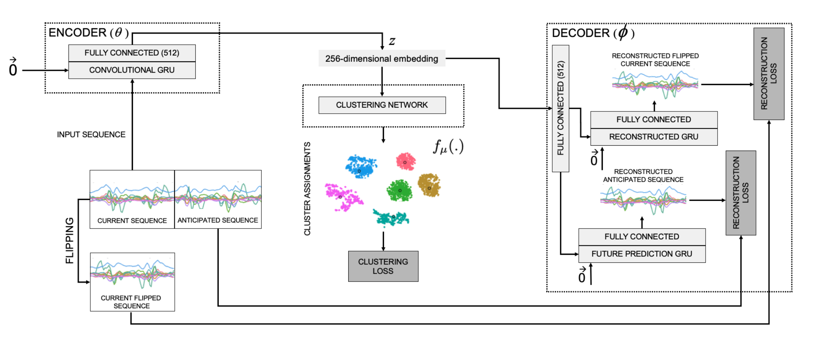

# Deep-Inertial-Sensory-Clustering for Human Activity Recognition


Implementation of **Deep Inertial Sensory Clustering architecture** in **PyTorch**.

For major details read [Unsupervised Deep Learning-based clustering for Human Activity Recognition](https://ieeexplore.ieee.org/abstract/document/9937141).

The proposed DL-based Clustering architecture is summarized in the following figure:




## Citation
If you use this code for your research, please consider citing:

```
  @INPROCEEDINGS{9937141,
       author={Amrani, Hamza and Micucci, Daniela and Napoletano, Paolo},
       booktitle={2022 IEEE 12th International Conference on Consumer Electronics (ICCE-Berlin)}, 
       title={Unsupervised Deep Learning-based clustering for Human Activity Recognition}, 
       year={2022},
       volume={},
       number={},
       pages={1-6},
       doi={10.1109/ICCE-Berlin56473.2022.9937141}
  }

```


## Contact me
If you have any questions regarding my work, contact me at h.amrani@campus.unimib.it
