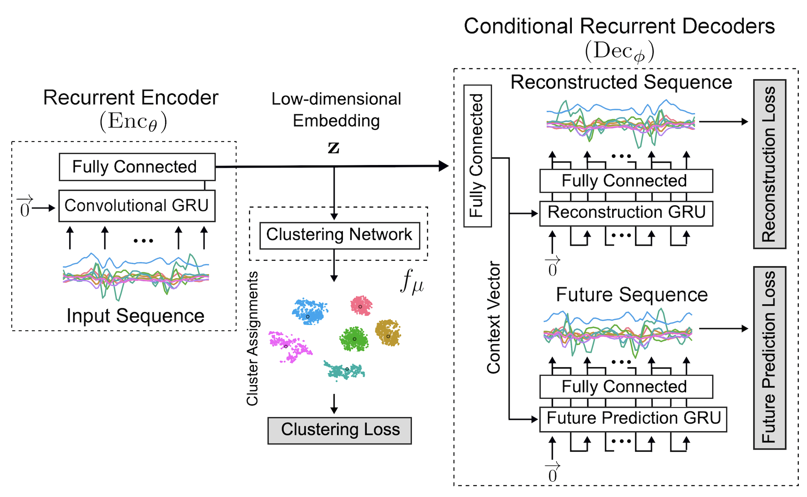

# Deep-Inertial-Sensory-Clustering

Implementation of **Deep Inertial Sensory Clustering architecture** in **PyTorch**.

For major details read **Section 4.2** of [https://github.com/hamzi27/Master-Thesis](https://github.com/hamzi27/Master-Thesis).

The proposed DL-based Clustering architecture is summarized in the following figure:

## Contact me
If you have any questions regarding my master's thesis, contact me at hamza.amrani@unimib.it

<!---
## Architecture

In the following, the proposed architecture of this work is explained. The explanation is divided into two subsections: the \emph{Multi-Task AutoEncoder} employed and the \emph{Clustering Criterion} adopted.

### Stage 1: Multi-Task AutoEncoder

The \emph{proposed RNN-AE architecture} consists of three RNNs: the encoder ConvGRU and two conditional decoder GRUs~\cite{cho2014learning}. The input to the model is a multi-channel sensor sequence. The encoder ConvGRU reads in this sequence. After the last input has been read, the two decoders GRU takes over and outputs a prediction for the reconstructed sequence and the anticipated sequence.

#### Recurrent Encoder ($Enc_{\theta}$)

The recurrent encoder $Enc_{\theta}$ takes as input a  raw multi-channel sensor sequence and learns a compacted latent representation to encode the spatio-temporal features of an Activity of Daily Living. 
In particular, a bi-directional Convolutional Gated Recurrent Unit (ConvGRU), an RNN that combines Gated Recurrent Units (GRUs) with the convolution operation, reads the sensory windowed sequence x in both forward and backward directions. It updates its hidden internal state in each time step according to the received input. The following equations give the update rule for input `x_t` and the previous output $h_{t-1}$:

\begin{equation} 
z_t = \sigma(W_z \star_n [h_{t-1};x_t]+b_z )
\end{equation}
\begin{equation} 
r_t = \sigma(W_r \star_n [h_{t-1};x_t]+b_r )
\end{equation}
\begin{equation} 
\tilde{h_t} = tanh (W_c \star_n [x_t; z_t\odot h_{t-1} ] + b_c)
\end{equation}
\begin{equation} 
h_t = (1-r_t)\odot \tilde{h_t} + r_t \odot h_{t-1} 
\end{equation}

where $z_t$ and $r_t$ are the \emph{update gate} and the \emph{forget gate}, $\sigma$ is the \emph{sigmoid} function, $\star_n$ represents a \emph{convolution} with a kernel of size $n\;$x$\;n$, $b$'s are \emph{bias terms} and $\odot$ denotes \emph{element-wise multiplication (or Hadamard product)}.

After scanning the entire input sequence $x$, the final hidden state is reduced in dimensionality through a fully connected layer:

\begin{equation} 
z = tanh(\psi(fc(h_t)))
\end{equation}

where $\psi$ is the \emph{Batch Normalization} operation which makes the encoder faster and more stable through normalization of the layers' inputs by re-centering and re-scaling.\\
The resulting low-dimensional embedded feature $z \in \mathbb{R}^z$ encodes contextual ADL information by representing the spatio-temporal dependencies present in the input sequence $x$. The operations associated with encoding the input sequence $x_i$ are summarized as:
\begin{equation} 
z_i=Enc_{\theta}(x_i)
\end{equation}

#### Conditional Recurrent Decoders ($Dec_{\phi}$)
The last hidden state of the encoder ConvGRU, after the dimensionality reduction, is the representation of the input sequence. The decoders GRU are being asked to reconstruct back the input sequence from this representation.
A decoder can be of two kinds – \emph{conditional or unconditioned}. A conditional decoder (see Figure~\ref{fig:cond_dec}) receives the last generated output hidden state as input. An unconditioned decoder does not receive that input. Using a conditional decoder is beneficial for multiple reasons. It allows the decoder to model multiple modes in the target distribution.\\
Moreover, if the decoder were given access to the last sequences while generating a particular sequence at training time, it would find it easy to pick up on these correlations. There would only be a minimal gradient that minimises the MSE requiring long-term knowledge about the input sequence. So, the input sequence is removed in a conditioned decoder, and the model is forced to look for information deep inside the encoder. 

In the proposed architecture, both recurrent decoders $Dec_{\phi}$ are conditional, and the following equations define the activation $h_t$:
\begin{equation} 
z_t = \sigma(W_z x_t + U_z h_{t-1} )
\end{equation}
\begin{equation} 
r_t = \sigma (W_r x_t + U_r h_{t-1} ))
\end{equation}
\begin{equation} 
\tilde{h_t} = tanh (W x_t + U(r_t \odot h_{t-1}))
\end{equation}
\begin{equation} 
h_t = (1-z_t)h_{t-1} + z_t \tilde{h_t}
\end{equation}

A context vector is obtained by back projecting the embedded representation $z$ from the encoder into a higher-dimensional space to initialize the decoders' hidden states. Two recurrent decoders GRU simultaneously use the context vector to achieve different self-supervised tasks. As in work~\cite{srivastava2015unsupervised}, the recurrent encoder is shared between decoders with two different expertise. The first decoder is specific to \emph{reconstruct} the temporally inverted input sequence, while the second one learns to \emph{predict} the future sequence that should follow after. So, training the network makes it possible to learn in-depth features that reproduce the input sequence and the information necessary to extrapolate future measurements.\\

The operations associated with decoding the embedded representation $z_i$ are summarized as:
\begin{equation} 
(\bar{y}_i^{\;rec},\bar{y}_i^{\;fut})=Dec_{\phi}(z_i)
\end{equation}
where $\bar{y}_i^{\;rec}$ and $\bar{y}_i^{\;fut}$ are the reconstructed and the anticipated sequences generated from the input $x_i$.

#### Non-Clustering Loss

The \emph{objective} of the Recurrent AutoEncoder is a joint objective function:
\begin{equation}
L_{AE}^{(i)} =  L_{rec}^{(i)} + L_{fut}^{(i)} = \left\| y_i^{\;rec} - \bar{y}_i^{\;rec} \right\|^2 + \left\| y_i^{\;fut} - \bar{y}_i^{\;fut} \right\|^2
\end{equation}
where $L_{rec}$ and $L_{fut}$ indicate the reconstruction loss and the future prediction loss, respectively, and denote the mean square errors between decoder's generated output sequences ($\bar{y}_i^{\;rec}$ and $\bar{y}_i^{\;fut}$ ) and the expected target sequences ($y_i^{\;rec}$ and $y_i^{\;fut}$ ).

Instead, the \emph{optimal network parameters} of encoder $z_i=Enc_{\theta}(x_i)$ and decoder $(\bar{y}_i^{\;rec},\bar{y}_i^{\;fut})=Dec_{\phi}(z_i)$ are updated by minimizing the reconstruction error:
\begin{equation} 
(\theta^*, \phi^*) =  min_{\theta, \phi} \; \frac{1}{n} \sum_{i=1}^{n} \; L_{AE}^{(i)}
\end{equation}

### Stage 2: Clustering Criterion

The reconstruction loss of the AutoEncoder is joined to the objective and optimized along with Clustering loss simultaneously, preserving the local structure of data generating distribution and avoiding the corruption of feature space.\\
A parametrized Clustering network $f_{\mu}(.)$ is connected to the AutoEncoder's embedded layer, allowing the estimation of cluster assignment distributions and mapping each embedded point $z$ of input sequence $x$ into a soft label. Then, the Clustering loss $L_C$ is defined as \emph{Kullback-Leibler (KL) divergence} between the distribution of soft labels and the predefined target distribution. Optimizing the Clustering objective makes it possible to refine the feature space and force the network to have Clustering-friendly representations. In particular, the \emph{Cluster Assignment Hardening (CAH)} is used as a representative centroid-based approach for feature space refinement.
The joint optimization criterion, for sample $i$, is:
\begin{equation} 
 L^{(i)} =  \gamma L_{C}^{(i)} + L_{AE}^{(i)}
\end{equation}
where the coefficient $\gamma \in [0,1]$ controls the Clustering objective contribution.\\
The optimal network parameters are optimized with respect to the global criterion as:
\begin{equation} 
(\theta^*, \phi^*, \omega^*) =  min_{\;\theta, \phi, \mu} \; \frac{1}{n} \sum_{i=1}^{n} \; L^{(i)}
\end{equation}
In the following, the CAH adopted is described.

#### Cluster Assignment Hardening

The Clustering objective uses the similarities between the data representations and cluster centroids as kernels to compute soft cluster assignments. Then, the CAH loss enforces the soft assignments to have more stringent probabilities.\\
The Clustering network $f_{\mu}(.)$ mantains cluster centroids ${\mu_j \in \mathbb{R}^z}_{j=1}^k$ as trainable weights and maps each embedded point $z_i$ into soft label $Q_i = f_{\mu}(z_i) = (q_{ij})^k_{j=1}$ by following the Student's $t$-distribution:
\begin{equation} 
q_{ij} = \frac{ (1 + \left\| z_i - \mu_j \right\|^2)^{-1} }{ \sum_{j'=1}^{k} (1 + \left\| z_i - \mu_{j'} \right\|^2)^{-1} }
\end{equation}
where  $q_{ij}$ is the $j$-th entry of $q_i$, which represents the probability of $z_i$ belonging to cluster $j$.

By squaring this distribution and then normalizing it, the auxiliary distribution $P_i = (p_{ij})^k_{j=1}$ forces assignments to have stricter probabilities (i.e. closer to 0 and 1. $P_i$ helps to improve cluster purity, emphasizing on data points assigned with high confidence, and to prevent large clusters from distorting the hidden feature space.\\
It is defined as:
\begin{equation}
p_{ij} = \frac{ q_{ij}^2 / \sum_i^n q_{ij}}{\sum_{j'=1}^{k} ( q_{ij'}^2 / \sum_{i=1}^n q_{ij'} )  }
\end{equation}
Lower the KL divergence value, the better we have matched the true distribution with our approximation.

The Clustering loss is defined through minimizing the \emph{Kullback-Leilbler (KL) divergence} between the soft labels and the auxiliary target distribution, via training the layer parameters:
\begin{equation}
L_C^{(i)} = KL (P_i || Q_i) = \sum_i^n \sum_j^k p_{ij} \; log \frac{p_{ij}}{q_{ij}}
\end{equation}

This centroid-based approach needs the cluster centroids to be \emph{initialized only once} at the beginning of the refinement stage. The initial cluster centroids are obtained from classical Clustering algorithms on the embedded representations $z_i=Enc_{\theta}(x_i)$ after the training of the recurrent AutoEncoder.\\

The proposed DL-based Clustering architecture is summarized in the following Figure.

\begin{figure*}[h]
  \centering
  \includegraphics[width=0.9\textwidth]{architecture.png}
  \caption{Proposed Deep Inertial Sensory Clustering architecture.}
  \label{fig:4proposedArchitecture}
\end{figure*}
-->
